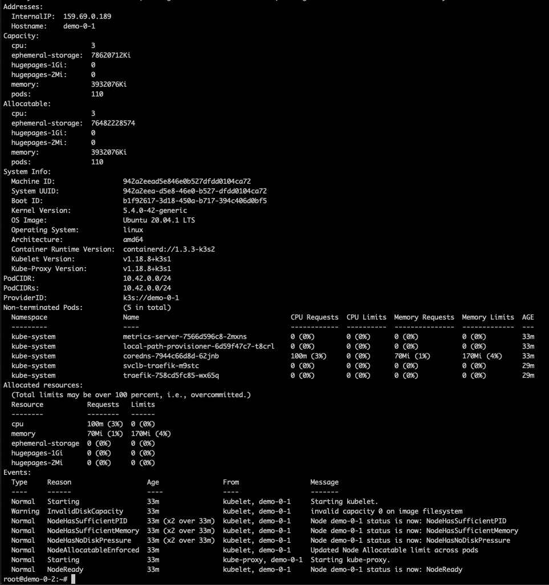
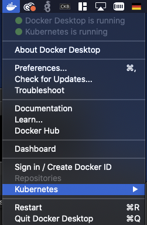

# :fa-flask: Lab 2: Kubectl, der Freund und Helfer

Das Kommandozeilen-Gegenstück zum Kubernetes-API heißt `kubectl` (gesprochen: wie es Ihnen beliebt). Die CLI läuft auch auf dem Server. Für gewöhnlich wollen Sie aber von Ihrer Entwicklungsmaschine zugreifen.

Zunächst zum Aufbau alle Befehle. Kubectl arbeitet mit Subcommands, meistens gefolgt vom Typ der Objekte, mit denen Sie arbeiten möchten. Einen Befehl haben Sie bereits kennengelernt:

```
kubectl get nodes
```

Er listet alle Nodes (Server) auf. Alle Pods (kleinste verteilbare Zusammenstellung aus Containern) sehen Sie mit:

```
kubectl get pods
```

Mit `describe` sehen Sie weitere Details. Die Reihenfolge ist immer wie folgt:

* Suchen Sie mit `kubectl get <objects>` den Namen (erste Spalte)
* Zeigen Sie sich Details mit `kubectl get <object> <name>`.

Lassen Sie sich die Details eines Ihrer Nodes anzeigen. Die Ausgabe sollte so aussehen:



## Arbeiten mit Namespaces

Namespaces unterteilen Ihr Cluster. Das erhöht nicht nur die Übersichtlichkeit in großen Systemen. In Mehrbenutzer-Umgebungen nutzen Sie Namespaces, um Berechtigungen einzugrenzen. Sollen Die Frontend-Entwickler zum Beispiel nur an ihren Pods arbeiten dürfen, bekommen sie einen Namespace. Den können Sie zum Beispiel per kubectl anlegen:

```
kubectl create namespace frontend
```

Um auf einen Namespace zu filtern, hängen Sie `-n frontend` an. Zum Beispiel:

```
kubectl get pods -n frontend
```

Alle Objekte aller Namespaces sehen Sie (sofern Sie das dürfen) mit

```
kubectl get pods -A
```

## Kubernetes fernsteuern

Anders als das Docker-API ist das Kubernetes-API dafür gedacht, dass man es aus der Ferne über das Internet bedient. Ohne Authentifizierung darf man nicht zugreifen.

Kubectl bekommen Sie auf unterschiedlichen Wegen auf Ihre Entwickler-Maschine:

* wenn Sie Docker Desktop für Windows oder macOS installiert haben, ist `kubectl` automatisch installiert.
* über einen Paketmanager Ihres Vertrauens



### macOS

Mac-Nutzer (ohne Docker Desktop ) kommen am schnellsten mit Homebrew zum Ziel:

```
brew install kubernetes-cli
```

### Linux 
Ubuntu-Nutzer bekommen die CLI auch per Snap:

```
sudo snap install kubectl --classic
```

Sie können die Binärdatei auch direkt herunterladen:

```
curl -LO https://storage.googleapis.com/kubernetes-release/release/$(curl -s https://storage.googleapis.com/kubernetes-release/release/stable.txt)/bin/linux/amd64/kubectl
```

Machen Sie die Datei anschließend ausführbar und kopieren Sie sie in den `PATH`:

```
chmod +x ./kubectl
sudo mv ./kubectl /usr/local/bin/kubectl
```

### Windows

Am besten greifen Sie zu Docker Desktop. Alternativ laden Sie die Exe-Datei direkt herunter:

```
curl -LO https://storage.googleapis.com/kubernetes-release/release/v1.19.0/bin/windows/amd64/kubectl.exe
```

Kopieren Sie die Datei anschließend in einen Ordner für ausführbare Dateien.


## Kubectl einrichten

Kubectl liest die Datei `~/.kube/config` ein, um sich mit Clustern zu verbinden. Diese Datei ist darauf ausgelegt, mehrere Cluster parallel zu verwalten. Je nach Installationsweg ist Ihre Datei vielleicht schon vorbefüllt (von Docker Desktop). Öffnen Sie die Datei in einem Texteditor Ihres Vertrauens.

Zunächst ein paar Sätze zum Aufbau dieser Datei. Ein einfaches Beispiel:

```
apiVersion: v1
clusters:
- cluster:
    certificate-authority-data: <pubkey des Servers>
    server: https://dev.example.org:6443
  name: dev-cluster
- cluster:
    certificate-authority-data: <pubkey des Servers>
    server: https://prod.example.org:6443
  name: prod-cluster
contexts:
- context:
    cluster: dev-cluster
    user: dev-user
  name: dev
- context:
    cluster: prod-cluster
    user: prod-user
  name: prod
current-context: dev
kind: Config
preferences: {}
users:
- name: dev-user
  user:
    password: 1234567890
    username: admin
- name: prod-user
  user:
    password: 0987654321
    username: admin
```

Zu Beginn werden Cluster definiert, hier ein Dev- und ein Prod-Cluster. Am Ende finden Sie Benutzer, einen Dev- und einen Prod-User. Beide melden sich per Basic-Auth an. In der Mitte finden Sie `contexts`. Das sind Zusammenstellungen aus einem User und einem Cluster – beide Kontexte haben einen Namen bekommen. Haben Sie Nutzer, die auf mehrere Cluster zgreifen dürfen, können Sie in den Kontexten kombinieren.

Zwischen den Kontexten wechseln Sie mit:

```
kubectl config use-context prod
kubectl config use-context dev
```

Jetzt müssen Sie die Zugangsdaten Ihres K3S-Clusters beschaffen. K3S legt diese in die Datei `nano /etc/rancher/k3s/k3s.yaml`. Zeigen Sie den Inhalt auf dem Server an und kopieren Ihn auf Ihre lokale Maschine:

```
cat /etc/rancher/k3s/k3s.yaml
```

Haben Sie keine anderen Cluster lokal, kopieren Sie die ganze Datei nach `~/.kube/config` (unter Windows am besten mit einer PowerShell mit Adminrechten). Ändern müssen Sie nur die Adresse von 127.0.0.1:6443 auf die Adresse Ihres Demo-Servers.

Haben Sie bereits andere Cluster lokal eingerichtet, müssen Sie jetzt etwas im Texteditor puzzlen. Kopieren Sie zunächst den Abschnitt mit  dem `-cluster` heraus und setzen ihn ein. Ändern Sie die Adresse auf die externe Adresse und achten Sie darauf, dem Cluster einen neuen Namen zu geben, falls `default` schon vergeben ist. Nennen Sie das Cluster etwa `demo`

Kopieren Sie dann den Abschnitt unter `users` in Ihre lokale Datei und nennen Sie ihn `demo`. Ergänzen Sie dann einen Kontext:

```
- context:
    cluster: demo
    user: demo
  name: demo
```

Speichern Sie ab, wechseln Sie ggf. den Kontext und probieren Sie die Konfiguration aus:

```
kubectl get nodes
```

!!! danger "Umgang mit Kontexten: Genau hinsehen!"
    Der Wechsel zwischen Kontexten ist nützlich, aber auch gefährlich. Achten Sie vor kritischen Befehlen daruf, wo Sie sich gerade befinden. Sie wären nicht der erste Admin, der versehentlich das Prod-Cluster demontiert, im festen Glauben, nur am Entwicklersystem zu schrauben.

    Im Zweifel hilft: `kubectl config current-context`

    Sehr unterhaltsam und lehrreich (für das Selbststudium): [How Spotify Accidentally Deleted All its Kube Clusters with No User Impact](https://www.youtube.com/watch?v=ix0Tw8uinWs)

## Randnotiz: Schöner arbeiten mit kubectl

Kubectl werden Sie sehr oft nutzen. Richten Sie sich am besten einen Alias für `k` ein. Auf der Bash zum Beispiel so:

Öffnen Sie die Datei `bash_aliases`:

```
nano ~/.bash_aliases
```

Richten Sie die Kurzform `k` ein:

```
alias k='kubectl'
```

Speichern Sie die Datei und laden Sie die Änderungen mit:

```
source ~/.bash_aliases
```

Jetzt sollte `k get pods` funktionieren.

## So geht es weiter

Bevor Sie in [Lab 3](../lab3) endlich den ersten Dienst veröffentlichen, zunächst etwas Begriffsklärung.