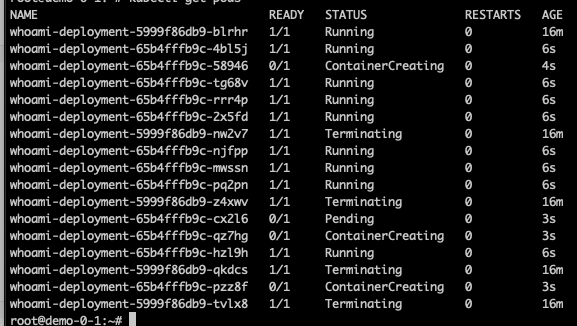

# :fa-flask: Lab 3: Der erste Dienst im Cluster

Mit dem Hintergrundwissen ausgestattet, richten Sie jetzt Ihren ersten Dienst im Cluster ein. Die Auszeichnungssprache der Wahl für `kubectl` ist YAML.

Die Dateien, mit denen Sie eine Anwendung beschreiben, sollten Sie nicht auf den Nodes liegenlassen. Denken Sie dran: Die Nodes sollten ersetzbar bleiben.
Im ersten Schritt lagern Sie diese auf Ihrer lokalen Maschine, im zweiten Schritt sollten Sie sich angewöhnen, die Beschreibungen in Git-Repos zu lagern.

!!! info "Infrastructure as Code"
    Mit Kubernetes kommen Sie dem Ziel extrem nah, dass der gesamte Zustand Ihrer Anwendung in der Versionsverwaltung liegt. Stellt sich eine Änderung als schlechte Idee heraus, können Sie leicht zu einem älteren Status wechseln.

Für den Workshop ist es unerheblich, ob Sie von Ihrer lokalen Maschine oder direkt auf einem der Server mit `kubectl` arbeiten.

## Der erste Dienst

Legen Sie in einem Ordner die Datei `deployment.yml` an. Die Benennung der Datei hat für Kubernetes keinerlei Bedeutung. Eine Datei kann beliebig viele Objekte enthalten. Alle YAML-Definitionen werden durch `---` getrennt.

Ein minimales Setup sieht so aus:

```
apiVersion: apps/v1
kind: Deployment
metadata:
  name: whoami-deployment
spec:
  replicas: 1
  selector:
    matchLabels:
      app: whoami
  template:
    metadata:
      labels:
        app: whoami
    spec:
      containers:
      - image: containous/whoami
        imagePullPolicy: Always
        name: whoami
        ports:
        - containerPort: 80
---
apiVersion: v1
kind: Service
metadata:
  name: whoami-service
  namespace: default
spec:
  type: NodePort
  selector:
    app: whoami
  ports:
  - protocol: TCP
    nodePort: 30000
    port: 8000
    targetPort: 80
---
```

Hier gibt es eine Menge zu erklären. Keine Angst: Niemand erwartet, dass Sie solche Deployments aus dem Kopf verfassen. Sie werden im Alltag wiederkehrende Muster haben und können sich nach einiger Zeit an Ihren eigenen Vorlagen bedienen.

Bevor wir die einzelnen Zeilen besprechen, lassen Sie Ihr Cluster schon einmal arbeiten und installieren Sie die Zusammenstellung:

```
kubectl -f deployment.yml apply
```

* Prüfen Sie, ob der Pod erfolgreich erstellt wurde (`kubectl get pods`).
* Finden Sie mit `kubectl describe pod` heraus, auf welchem Node der Pod läuft
* Rufen Sie die Adresse der beiden Pods im Browser auf (`demo-0-1.example.org:30000`). Außerdem die gemeinsame DNS-Adresse (`www.0.example.org:30000`);

Kubernetes kümmert sich um das Routing zum Pod. Es ist egal, wo der Pod gerade liegt.

!!! note "Loadbalancer"
    Ein einfaches DNS-Round-Robin ist natürlich kein besonders ausgereifter Loadbalancer. Der DNS-Server erfährt zum Beispiel nicht, wenn ein Node offline ist. Die Hosting-Anbieter haben oft Loadbalancer im Programm. Alternativ können Sie auch eigene Loadbalancer lokal betreiben oder von Anbietern online anmieten.

## Ändern und Skalieren

Beim Ändern und Skalieren sehen Sie die Unterschiede zwischen Kubernetes und Docker am deutlichsten. Zum Ändern eines Deployments müssen Sie die Zusammenstellung nicht herunter- und herauffahren. Öffnen Sie die Datei und ändern Sie die Anzahl der `replicas`. Speichern Sie die Datei und schicken Sie die neue Datei ans Cluster:

```
kubectl -f deployment.yml apply
```

Beobachten Sie den Erfolg mit `kubectl get pods` oder `kubectl get deployments`.

Skalieren kann man auch über die Kommandozeile. Finden Sie mit `kubectl get deployments` den Namen des Deployments heraus

```
kubectl scale deployment <Name> --replicas=12
```

Solche Eingriffe sind aber nur beschränkt empfehlenswert. Wenn Sie einmal damit beginnen, Änderungen direkt per Befehl ins Cluster zu schreiben, ist es vorbei mit "Infrastructure as Code".

## Schöner ausrollen

Das Ausrollen von Updates ist eine der großen Stärken von Kubernetes. In der Standardeinstellung werden die Container per `Recreate` ersetzt. Brauchen die Pods länger zum Hochfahren, kann es zu Ausfällen des Dienstes kommen. Häufig ist die Strategie `RollingUpdate` eine hilfreiche Alternative. Im `whoami`-Beispiel werden Sie den Unterschied nur per `kubectl` sehen. Die Container sind zu schnell beim Hochfahren. 

Folgendes könnten Sie in die Datei `deployment.yml` einsetzen:

```
  replicas: 12
  strategy:
    type: RollingUpdate
    rollingUpdate:
      maxSurge: 5
      maxUnavailable: 3
```

`maxSurge` gibt an, wie viele Pods neu hochgefahren werden dürfen. `maxUnavailable` weist Kubernetes an, wie viele zeitgleich vom Netz genommen werden dürfen. Welche Werte für Ihre Anwendung sinnvoll sind, hängt von sehr vielen Faktoren ab – vor allem von der Bootzeit der Anwendungen in den Containern. Für solche Zwecke brauchen Sie ein Dev-Cluster, um verschiedene Strategien zu testen.

Wenn Sie dem `RollingUpdate` bei der Arbeit zusehen wollen, ändern Sie den Tag des `whoami`-Images auf:

```
- image: containous/whoami:v1.5.0
```

Anschließend schreiben Sie die Änderungen wie gewohnt. Beobachten Sie den Ausrollprozess (schnell sein hilft). Wenn Sie den Moment verpasst haben, so sieht es in etwa aus:



## Keine Panik bei Problemen

Fehler kommen vor, auch wenn Sie vorher gründlich im Dev-System getestet haben. Wenn ein Update mal so gar nicht rund läuft, können Sie es mit `kubectl` zügig rückgängig machen. Kubernetes merkt sich die Geschichte Ihrer Änderungen.

So zeigen Sie die Änderungen an:

```
kubectl rollout history deployment/whoami-deployment
```

So zeigen Sie an, was sich in einer Revision geändert hat:

```
kubectl rollout history deployment/whoami-deployment --revision=3
```

Und so machen Sie die letzte Revision rückgängig:

```
kubectl rollout undo deployment/whoami-deployment
```

Wenn Sie den letzten Befehl ausprobieren, wechselt das Deplyment wieder zurück auf den `latest`-Tag für den Container `whoami`.