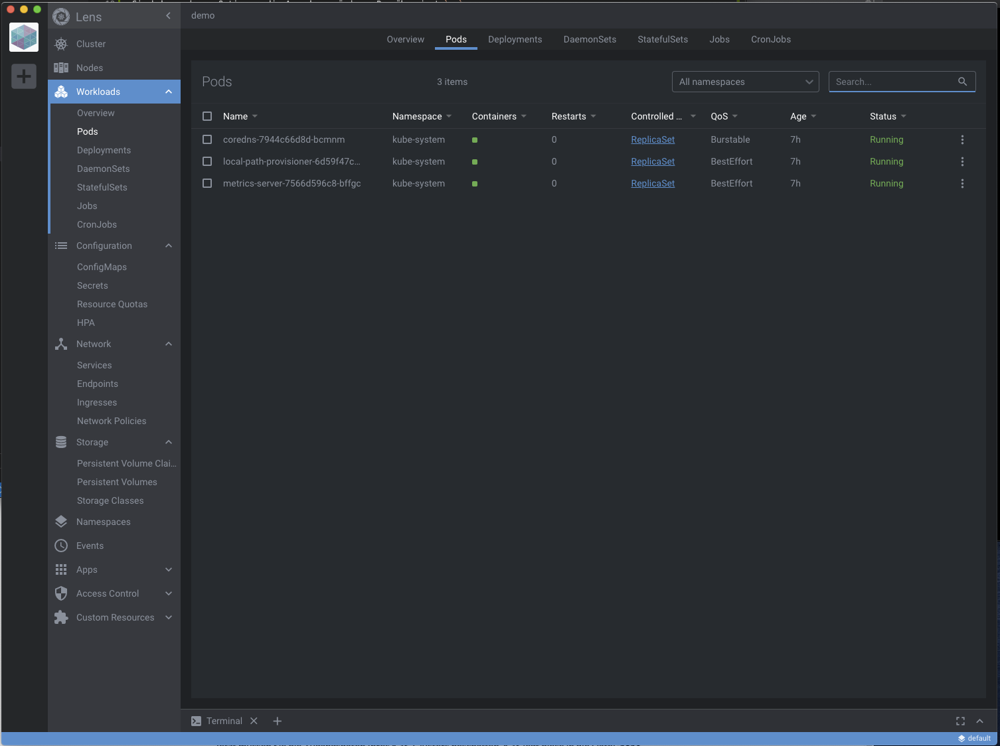

# :fa-flask: Lab 4: Ausblick und Einblicke

Die Kommandozeilenanwendung `kubectl` kann noch mehr, als wir am ersten Tag ausprobieren konnten. Nützlich ist es manchmal, mehr Details, also mehr Spalten, anzuzeigen. Ein einfaches

```
kubectl get pods
```

gibt nur die fünf vermeintlich wichtigsten Spalten aus:

```
NAMESPACE     NAME                                     READY   STATUS    RESTARTS   AGE
kube-system   local-path-provisioner-6d59f47c7-z9zpq   1/1     Running   0          7h13m
kube-system   metrics-server-7566d596c8-bffgc          1/1     Running   0          7h13m
kube-system   coredns-7944c66d8d-bcmnm                 1/1     Running   0          7h13m
```

Sie haben mehrere Optionen, die Ausgabe zu ändern. Das übernimmt `-o`:

| Wert | Ergebnis |
|---|---|
|`-o wide`| Zeigt mehr Details, zum Beispiel den Node eines Pods. Erst|
|`-o json`| Zeigt die Rückgabe als JSON. Nützlich für Automationen (CI/CD)|
|`-o custom-columns=NAME:.metadata.name,NODE:.spec.nodeName`| Für Perfektionisten: Wählen Sie selbst aus, welche Spalten Sie brauchen. Am bester erst als JSON ausgeben und daran die Namen der Felder ablesen. Am Ende als Alias ablegen.|

## Für Freunde von GUIs: Lens

Lens ist ein weiterer Zugang zum Cluster (oder zu mehreren). Lens ist eine Desktop-Anwendung, die es für Linux, Windows, macOS gibt. Lens bedient sich an der Konfig-Datei `~/.kube/config` und zeigt Details übersichtlich an.



Herunterladen kann man [Lens bei GitHub](https://github.com/lensapp/lens/releases/tag/v3.5.3). Veröffentlicht ist sie unter MIT-Lizenz. Das Unternehmen, das sich Lens ausgedacht hat, gehört seit einigen Wochen zum mittlerweile recht bekannten Cloud-Dienstleister Mirantis (dem neuen Eigentümer von Docker Enterprise).

## Tiefer einsteigen: Angebote der CNCF

Wer sich intensiver mit Kubernetes beschäftigt, sollte unbedingt einen Blick auf den Pfad jenseits der Kern-Funktionen werfen.

Eine erste Anlaufstelle sind die Landscapes der CNCF:


Wem das als Inspiration nicht reicht, der findet (fast) alle Projekte aus dem Ökosystem unter [https://landscape.cncf.io](https://landscape.cncf.io) (Achtung: Nicht verzetteln, die Karte ist sehr umfangreich!).

Genug der Vorrede: Zeit für ein komplexes Projekt im Cluster. Damit geht es in [Lab 5](../lab5) weiter.