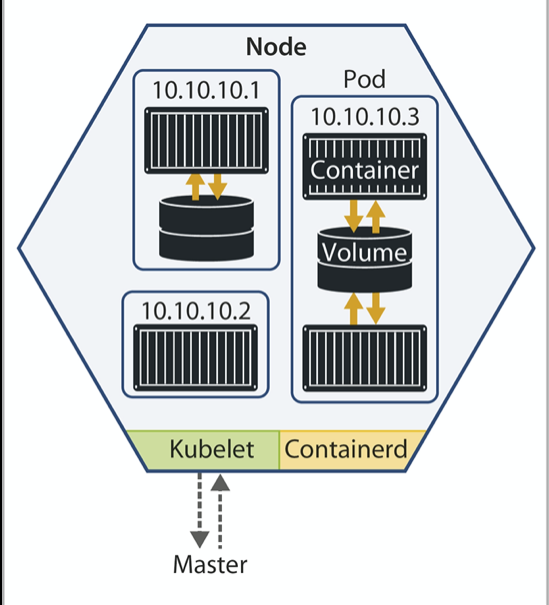

 ## Herzlich Willkommen


1. und 2.9.2020
---

## Ihr Dozent

* Jan Mahn
* seit 2017 c't-Redakteur im Ressort Systeme und Sicherheit
* zuständig für Server-Systeme, Container, Software-Entwicklung
* Docker-Nutzer seit 2017
* Kubernetes-Nutzer seit 2018

---

# Warum wir Container nutzen

Es geht um:  <!-- .element: class="fragment" data-fragment-index="1" -->
* Flexibilität <!-- .element: class="fragment" data-fragment-index="2" -->
* Ersetzbare Server <!-- .element: class="fragment" data-fragment-index="3" -->
* Weniger Ärger mit Abhängigkeiten <!-- .element: class="fragment" data-fragment-index="4" -->

--- 

## Nutztiere und Haustiere

"In der Container-Welt sind Container nur Nutzvieh. Sie sind ersetzbar! Stirbt einer, übernimmt der nächste. Kein Grund zur Trauer."

---

# Der typische Docker-Host

* enthält eine Sammlung an Docker-Compose-Dateien  <!-- .element: class="fragment" data-fragment-index="1" -->
* auf dem Docker-Host wird mit `docker` und `docker-compose gearbeitet` <!-- .element: class="fragment" data-fragment-index="2" -->
* nach einiger Zeit baut man wieder eine Beziehung zum Server auf und pflegt ihn mehr, als man eigentlich wollte <!-- .element: class="fragment" data-fragment-index="3" -->

---

## Die Evolution der Technik

* Virtualisierung löst all unsere Probleme mit Servern <!-- .element: class="fragment" data-fragment-index="1" -->
* Docker löst all unsere Probleme mit Virtualisierung <!-- .element: class="fragment" data-fragment-index="2" -->
* Kubernetes löst all unsere Probleme mit Docker <!-- .element: class="fragment" data-fragment-index="3" -->
* ... <!-- .element: class="fragment" data-fragment-index="4" -->

---

## Kubernetes: Containern weiter gedacht

Mit einem Kubernetes-Cluster:

* beschreiben Sie Ihre gewünschte Infrastruktur, meist in YAML. <!-- .element: class="fragment" data-fragment-index="1" -->
* konfigurieren Sie Details, die in `docker-compose` fehlen. <!-- .element: class="fragment" data-fragment-index="2" -->
* lassen Sie Container auf Funktion prüfen und ersetzen. <!-- .element: class="fragment" data-fragment-index="3" -->
* skalieren Sie Dienste, wenn die Last höher wird <!-- .element: class="fragment" data-fragment-index="4" -->
* verteilen Sie die Last auf viele Maschinen <!-- .element: class="fragment" data-fragment-index="5" -->

---

## Was Kubernetes anders macht

* Läuft auf mehreren Hosts (max. 5000 pro Cluster)
* ist auf Skalierbarkeit ausgelegt
* Arbeitet deklarativ, nicht imperativ

--- 

## Docker arbeitet imperativ

"Hey Docker, starte einen Container"

```
docker run ...
```

"Hey Docker, lösche ihn wieder"

```
docker stop ...
```

Auch docker-compose ist imperativ

---

## Kubernetes-Admins definieren Zustände

"Hey Cluster: So soll die Umgebung aussehen. Kümmere dich drum."

---
## Aufbau eines Clusters


---

## Lab 1: Das eigene Cluster

Alle Workshop-Inhalte finden Sie unter [docs.liefer.it](https://docs.liefer.it)


---

## Begriffskunde

* **Nodes** sind Server mit installiertem Kubernetes, zu einem Cluster verbunden
* **Pods** sind die kleinste verteilbare Einheit. Sie können aus mehreren **Containern** bestehen. 
* **Services** sind die Weiterentwicklung von `ports` in einer Docker-Umgebung. Sie erlauben elegantes Loadbalancing

---



---

## Ihre Fragen zum ersten Tag

Am zweiten Tag routen wir eingehenden Verkehr, schauen auf Logs und veröffentlichen eine komplexere Zusammenstellung mit persistentem Speicher.

Sollten im Laufe des Nachmittags Fragen gekommen sein: jam@ct.de